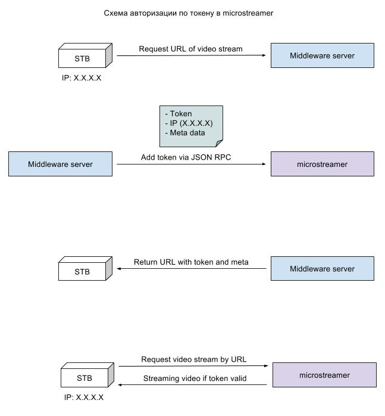

.. _microstreamer:

********
Описание
********

**microstreamer** - программное обеспечение сервера *Microimpuls Streamer*,
предназначенное для Unicast-видеостриминга в формате HTTP MPEG-TS chunked streaming.
В качестве входного потока по-умолчанию используется UDP Multicast, однако может быть настроен любой формат потока,
который поддерживает библиотека *libmedia* (см. :ref:`Формат URI <uri-format>`).

.. _system-requirements:

********************
Системные требования
********************

microstreamer предназначен для работы в ОС Linux Debian 64-битной версии и подобных
дистрибутивах, по-умолчанию поставляется версия для архитектуры amd64.

*Внимание! ПО microstreamer не предназначено для работы на виртуальной машине по причине негарантированной стабильности
работы виртуального сетевого адаптера.*

Требования к аппаратному обеспечению, исходя из принимаемого/передающегося объема трафика:

+--------------------+------------------------------------------------------------------------------------------------------+
| Процессор          | 1 ядро 2.4Ghz+ на каждые 400Mbps трафика                                                             |
+--------------------+------------------------------------------------------------------------------------------------------+
| Оперативная память | 1GB на каждые 400Mbps трафика                                                                        |
+--------------------+------------------------------------------------------------------------------------------------------+
| Сетевая карта      | карта с Enterprise чипом Intel, имеющая несколько очередей для входящих пакетов (multiple Rx queues) |
+--------------------+------------------------------------------------------------------------------------------------------+

.. _install-and-using:

*************************
Установка и использование
*************************

Для работы microstreamer необходимо наличие библиотек *libmedia*, *libjsonrpc*, *libjson*, *libhttp*.

*libmedia* - библиотека для работы с UDP/TCP сокетами, разрабатывается вместе с microporter, microstreamer и другими продуктами.

*libhttp* - библиотека реализации HTTP MPEG-TS сервера вещания, разрабатывается вместе с microstreamer.

microstreamer, а также все необходимые библиотеки совместимых версий, поставляются в виде
установочных deb-пакетов и устанавливаются утилитой dpkg. См. :ref:`Где взять <download-software>`.

Для запуска используется init.d скрипт: ``/etc/init.d/microstreamer``, доступные аргументы:
::
    $ /etc/init.d/microstreamer
    Usage: /etc/init.d/microstreamer {start|stop|restart|force-reload|reload}

Файлы логов по-умолчанию сохраняются в ``/var/log/microstreamer/microstreamer.log``,
включена ротация логов через logrotate.d

.. _download-software:

Где взять
=========

Для всех
  Скачать необходимые инсталляционные пакеты можно в официальном техническом сообществе Microimpuls
  по ссылке http://forum.micro.im/ в разделе "Дистрибутивы и обновления ПО".

Для инженеров Microimpuls
  При установке ПО на сервер через систему оркестровки все необходимые установочные пакеты
  актуальных версий скачиваются из репозитория автоматически.

.. _configuration:

Конфигурация
============

Файл конфигурации находится в ``/etc/microstreamer/microstreamer.conf``,
задаётся в формате JSON. Пример:
::
    {
        "log-syslog": false,
        "log-facility": 0,
        "log-path": "/var/log/microstreamer/microstreamer.log",
        "log-verbose-level": 3,
        "log-foreground": false,
        "json-rpc-enabled": true,
        "json-rpc-listen-host": "0.0.0.0",
        "json-rpc-listen-port": 9089,
        "streaming-enabled": true,
        "http-port": 8080,
        "priority": 0,
        "latency-events": 50,
        "disconnect-slow-clients": false,
        "drain-buffer-slow-clients": true,
        "max-client-buffer": 48000000,
        "auth-enabled": false,
        "auth-salt": "testsalt",
        "secret": "6bc3fb2292542160552ac8f142c1c93c",
        "http-max-ts": 20000,
        "http11-enabled": false,
        "clear-old-keys": true,
        "paired-users-ip-block": false,
        "stream-alive-timeout": 5,
        "license-owner": "Demo",
        "license-streams-limit": 20,
        "license-code": "1452c-527c0-8cbfe-74f10-15f5a",
        "streams": [
            {
                "name": "Dummy channel",
                "enabled": true,
                "src": "239.152.2.1 1234 multicast udp",
                "url": "/dummy/",
                "payload-size": 1316, // b
                "ttl": 32
            }
        ]
    }

.. _general-options-description:

Описание параметров
-------------------

log-syslog ``bool``
  Использовать ли службу syslogd для записи логов в /var/log/syslog.
  Не рекомендуется включать при интенсивном логировании.

log-facility ``int``
  Тег в syslog.

log-path ``str``
  Путь до лог-файла для логирования напрямую без syslogd.

log-verbose-level ``int``
  Уровень логирования от 0 до 9, 9 - максимальный DEBUG уровень.

log-foreground ``bool``
  Вывод лога в stdout.

json-rpc-enabled ``bool``
  Включает интерфейс JSON RPC API. Через этот API без перезапуска microstreamer
  отдельные потоки могут быть приостановлены или перезапущены.

json-rpc-listen-host ``str``
  Адрес интерфейса для ожидания входящих подключений к JSON RPC API.
  Значение "0.0.0.0" означает слушать на всех интерфейсах.

json-rpc-listen-port ``int``
  Номер порта TCP для JSON RPC API, по-умолчанию 9089.

streaming-enabled ``bool``
  Глобальный флаг, если true - видеостриминг включен, false - выключен.

http-port ``int``
  Порт, на котором http-сервер будет ожидать входящие подключения.

priority ``int``
  Приоритет процесса в ОС, 0 - автоматический приоритет по выбору ОС.
  Не рекомендуется использовать высокий приоритет при большом количестве анализируемых потоков.

latency-events ``int``
  Задержка обработки событий сокета, задается в миллисекундах. Чем меньше значение, тем меньше будет
  задержка показа видео при первом подключении и тем быстрее будут обрабатываться входящие соединения.
  Чем больше значение, тем выше нагрузка на CPU.

disconnect-slow-clients ``bool``
  При включении этой опции клиенты с медленным интернет-соединением будут отключены от видеопотока при
  достижении очереди неотправленных пакетов значения *"max-client-buffer"*.

drain-buffer-slow-clients ``bool``
  При включении этой опции поведение, заданное *"disconnect-slow-clients"*, игнорируется, а вместо
  отключения очередь пакетов для клиента будет опустошена со сдвигом видеопозиции на текущий момент
  времени. Таким образом, у клиента с медленным интернет-соединением будут происходить плавные
  переходы во времени для поддержания актуальности стриминга.

max-client-buffer ``int``
  Максимальный размер очереди неотправленных пакетов клиенту в байтах. По достижению максимума
  очередь опустошается и происходит одно из действий, описываемых опциями выше.

auth-enabled ``bool``
  Включает встроенный механизм авторизации потоков по одноразовым токенам.
  См. :ref:`Логика работы механизма авторизации потоков <auth-logic-description>`.

auth-salt ``str``
  Дополнительная "соль" для защиты ключа авторизации при хешировании.

secret ``str``
  Секретный ключ оператора, который может быть передан в HTTP запросе в аргументе ``?s=`` для обхода
  авторизации.

http-max-ts ``int``
  Максимальное число байтов в порции данных, отправляемых клиенту сервером за один http-ответ при
  использовании chunked streaming (требуется включить так же поддержку HTTP 1.1).

http11-enabled ``bool``
  Включить поддержку HTTP 1.1 и chunked streaming.

clear-old-keys ``bool``
  Включает регулярный таймер проверки и очистки старых ключей и сессий, необходим для дополнительного
  контроля за освобождением выделенных ресурсов.

paired-users-ip-block ``bool``
  Включает блокировку подключения к потокам с разных IP-адресов аккаунтами одного абонента. Данные аккаунта
  передаются через JSON API при размещении ключа авторизации. Используется только при включенной опции
  *"auth-enabled"*.

stream-alive-timeout ``int``
  Время в миллисекундах, после которого считается, что на входящем видеопотоке нет данных и требуется
  разорвать соединение с клиентом. При нестабильных видеопотоках увеличением этого значения можно
  стабилизировать услугу видеостриминга.

license-owner ``str``
  Имя лицензии.
  см. :ref:`Настройка лицензии <license-setup>`

license-streams-limit ``int``
  Количество потоков, разрешенное лицензией.

license-code ``str``
  Лицензионный ключ.

streams ``list``
  Список потоков для видеостриминга.

.. _stream-options-description:

Описание параметров потоков в списке streams
--------------------------------------------

name ``str``
  Имя потока.

enabled ``bool``
  Флаг активности стриминга потока.

src ``uri``
  Адрес, на котором ожидается прием потока.

url ``str``
  Имя URL, по которому будет доступен поток.

payload-size ``int``
  Размер полезных данных в байтах в одном сетевом пакете входного потока.
  По-умолчанию, значение 1316, соответствует максимальному размеру пакета, который помещается в стандартный MTU 1500.
  Значение 1316 (7 TS-фреймов по 188 байт) подходит для большинства случаев.

ttl ``int``
  Время жизни пакета.

.. _uri-format:

Формат адреса uri
-----------------

Адрес входного потока задается в формате:
::
    <ip> <port> <cast_type> <protocol> [<path>]

Доступные *cast_type*: ``multicast``, ``unicast``, ``file``.
Доступные *protocol*: ``udp``, ``tcp``, ``ts``.

При использовании типа ``file``, в качестве *ip* задаётся путь к директории,
а в качестве *port* имя файла.

Парметр ``path`` испольуется только при *cast_type* ``http`` и определяет путь до потока на сервере.

В режиме ``unicast tcp`` microstreamer будет готов обработать входящее подключение от `microporter <http://mi-microporter-docs.readthedocs.io/en/latest/index.html>`_.

Примеры:
::
    "239.0.0.1 1234 multicast udp"
    "0.0.0.0 2001 unicast tcp"
    "/home/storage filename.ts file ts"
    "10.0.34.23 8081 http tcp /ch1/"

.. _auth-logic-description:

Логика работы механизма авторизации потоков
-------------------------------------------

Схема работы авторизации
~~~~~~~~~~~~~~~~~~~~~~~~

Создание и отправка токена
++++++++++++++++++++++++++

В момент получения запроса от клиента на URL видеопотока сервером Middleware генерируется одноразовый токен
на основании секретной строки (соли) и IP-адреса клиента, после чего через JSON-RPC API интерфейс отправляется в microstreamer.

Алгоритм генерации токена выбирается на усмотрение сервера Middleware, это может быть любая случайно сгенерированная
последовательность символов.

RPC-метод в microstreamer для добавления ключа - ``add_connection_key``. Он принимает следующие параметры:

uid ``int``
  Идентификатор абонента (лицевого счета) в системе Middleware.

aid ``int``
  Идентификатор аккаунта (услуги) в системе Middleware. Используется для мониторинга и работы механизма
  блокировки одновременного доступа с разных IP-адресов разных аккаунтов абонента.

user_info ``str``
  Информация об абоненте в свободной форме. Используется для последующего мониторинга онлайн-подключений.

ip ``str``
  IP-адрес клиента, к которому привязывается токен и с которого будет произведено подключение к http-стримеру.

pass ``str``
  Токен.

duration ``int``
  Время жизни токена в секундах.

Результат выполнения операции метод возвращает в поле ``result``. В случае успеха в этом поле будет внутренний
идентификатор токена в microstreamer (числовое значение), в случае ошибки - описание ошибки (строка).

Добавление токена и других параметров к URL видеопотока для плеера
++++++++++++++++++++++++++++++++++++++++++++++++++++++++++++++++++

Для валидации токена и клиента на microstreamer сервер Middleware должен модифицировать URL видеопотока,
добавив к нему следующие параметры:

p ``str``
  Токен.

key ``str``
  Ключ валидации токена.

u ``int``
  Идентификатор абонента (поле uid).

a ``int``
  Идентификатор аккаунта (поле aid).

Алгоритм генерации ключа валидации ``key``:
::
    KEY = MD5(SALT + IP)

где ``SALT`` должно совпадать со значением опции ``auth-salt`` в файле конфигурации microstreamer,
а ``IP`` это IP-адрес клиента, с которого он будет подключаться к microstreamer, обращаясь за видеопотоком.

.. warning::
    Длина всего URL-запроса с параметрами к microstreamer не должна превышать 128 символов.

Пример кода
+++++++++++

microstreamer.conf:
::
    ...
    "auth-enabled": true,
    "auth-salt": "foobar",
    ...

/some-tv-middleware/get_url.php:
::
    ...
    $token = uniqid("", true);
    $key = md5("foobar".$_SERVER['REMOTE_ADDR']);

    $rpc = new jsonRPCClient("1.2.3.4", 9089, false);
    $rpc->add_connection_key(array(
        'uid' => 1, 'aid' => 2,
        'user_info' => "User 1, Account 2",
        'ip' => $_SERVER['REMOTE_ADDR'],
        'pass' => $token,
        'duration' => 30
    ));

    $url = "http://1.2.3.4:8080/streamurl/?p=$token&key=$key&u=1&a=2";
    ...

.. _license-setup:

Настройка лицензии
------------------

Лицензионный ключ генерируется на основании уникального идентификатора сервера и
привязывается к его аппаратной и программной конфигурации, а также к значениям параметров
``license-owner`` и ``license-streams-limit``.

При запуске microstreamer без лицензионного ключа в лог-файл будет выведен специальный
многострочный медиа-код, на основании которого генерируется лицензионный.

Для получения ключа необходимо обратиться к своему менеджеру или отправить письмо на адрес support@microimpuls.com.
Запрос должен содержать медиа-код и информацию об имеющемся договоре.

.. _monit-script:

Скрипт для monit
================

Для слежения за процессами microstreamer удобно использовать monit, пример скрипта:
::
    check process microstreamer with pidfile /var/run/microstreamer.pid
        start program = "/etc/init.d/microstreamer start" with timeout 60 seconds
        stop program  = "/etc/init.d/microstreamer stop"
        if cpu > 60% for 2 cycles then alert
        if cpu > 90% for 5 cycles then restart
        if totalmem > 6000.0 MB for 5 cycles then restart
        if 3 restarts within 5 cycles then timeout
        group microstreamer

.. _multiinstance-configuration:

Установка нескольких инстансов microstreamer
============================================

Установка и работа нескольких копий процесса microstreamer на одном сервере допускается.
Для удобства администрирования такого сервера рекомендуется разные конфигурации сохранять
в отдельных конфигурационных файлах, при этом именуя конфиг-файл с суффиксом в конце,
а также создавать отдельный monit-конфиг и init-скрипт для каждого инстанса.

Пример:

``/etc/microstreamer/microstreamer.foo.conf`` ``/etc/init.d/microstreamer.foo``
``/etc/microstreamer/microstreamer.bar.conf`` ``/etc/init.d/microstreamer.bar``

Внутри init-скрипта суффикс можно прописать в переменной ``SUFFIX``, при этом прописывается сам суффикс,
для примера выше это ``.foo``, ``.bar``.

******************************
Решение проблем и рекомендации
******************************

Рекомендуемые параметры ядра
============================

Изменения нужно вносить в файл /etc/sysctl.conf:
::
    kernel.shmmax = 2473822720
    kernel.shmall = 4097152000
    net.core.rmem_default = 262144
    net.core.rmem_max = 8388608
    net.core.wmem_default = 262144
    net.core.wmem_max = 8388608
    net.ipv4.tcp_syncookies = 1
    net.ipv4.tcp_tw_recycle = 0
    net.ipv4.tcp_tw_reuse = 0
    net.ipv4.tcp_keepalive_time = 10
    net.ipv4.tcp_fin_timeout = 5

Затем выполнить команду для применения изменений:
::
    sysctl -p

Дополнительные настройки ОС при очень большом количестве одновременных подключений
==================================================================================

В файле ``/etc/security/limits.conf`` необходимо прописать:
::
    *               soft    nofile          16384
    *               hard    nofile          16384
